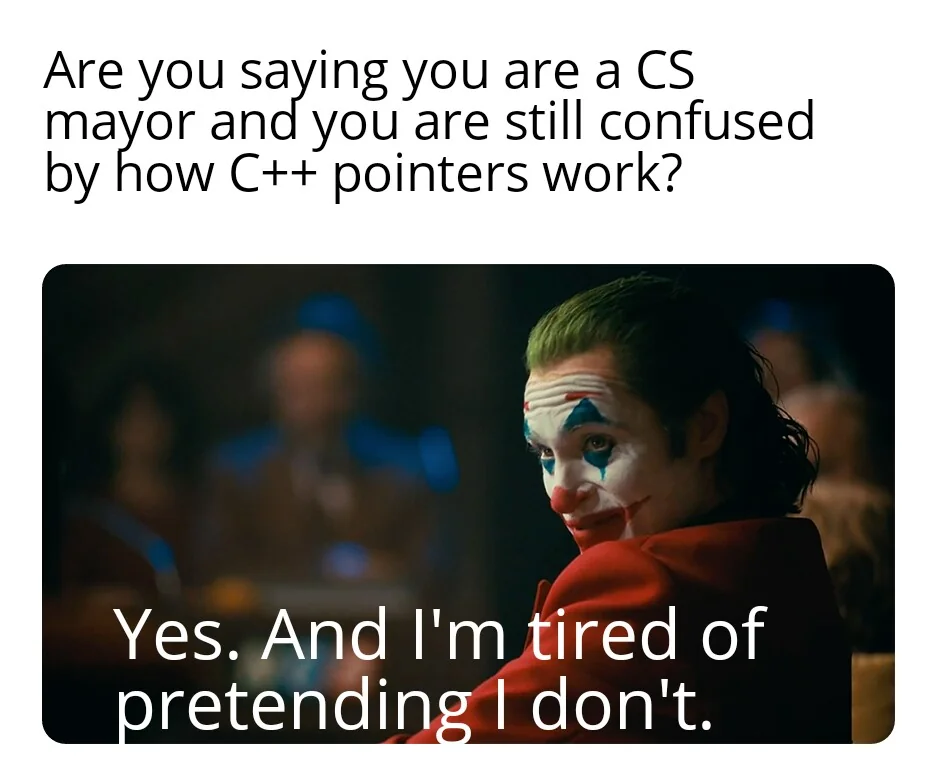
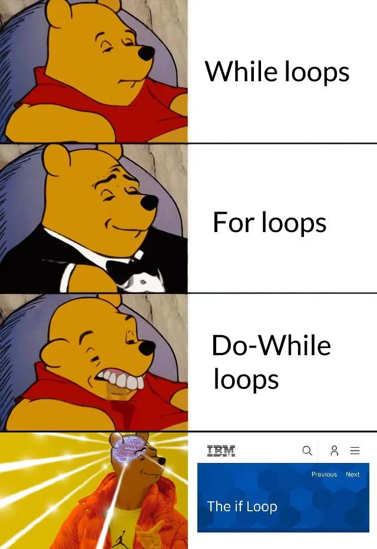
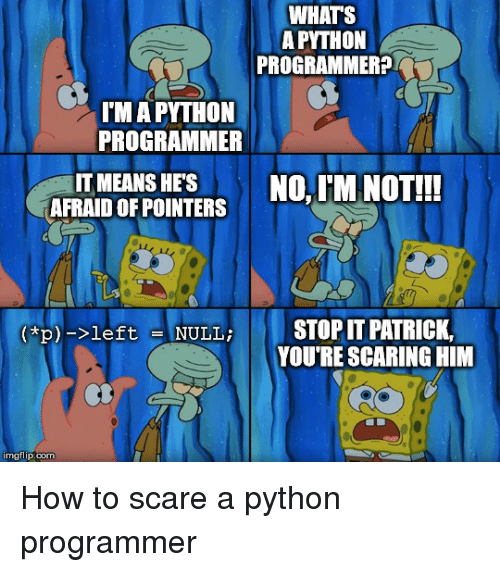

<div class="px-3 py-2 rounded-lg text-center" style="border: 5px solid #111111; background-color: #38434f;">
Check out the previous post before reading this! <br>
<a href="/blogs/c2bf-p1?scrollTo=top">Compiling Python to Brainf**k</a>
</div>

### Python-like High-Level Language

Now that we have a BF CPU, we can start building a high-level language that compiles into Assembly. 

First part of the compiler is the lexer/parser. I built a parser that uses a SPEC to define a language's grammer, and parses input code into an AST. Here's an example:

#### Procedural Parsing
```json
{
    "VARIABLE": ["REGEX_MATCH", "([_a-zA-Z$][_a-zA-Z$0-9]*)\\b"],
    "NUMBER": ["REGEX_MATCH", "([0-9]+)\\b"],

    "assignment": ["VARIABLE", "=", "expression"],

    "expression": ["e_mul", ["REPEAT", "e_mul"]],

    "e_mul": ["e_add", ["REPEAT", ["e_mul_operator", "e_add"]]],
    "e_mul_operator": ["ONE_OF", ["*", "/"]],

    "e_add": ["e_unit", ["REPEAT", ["e_add_operator", "e_unit"]]],
    "e_add_operator": ["ONE_OF", ["+", "-"]],

    "e_unit": ["ONE_OF", ["VARIABLE", "NUMBER", "e_par"]],

    "e_par": ["(", "expression", ")"],

    "statement": ["ONE_OF", ["expression", "assignment"]],
}
```
This is a simple language spec that supports multiplicative, additive, and assignment expressions. There are a bunch of directives (like `REPEAT`, `ONE_OF`, `REGEX_MATCH`) that I think are pretty self-explanatory. With a spec like this, we can [figure out all the reserved tokens](https://github.com/ShanThatos/compile-pythonic-to-bf/blob/main/c2bf/parser/main.py#L159) that are needed to parse the input code! 

For example, the reserved tokens for the above spec are: \
`(, ), +, -, *, /, =, VARIABLE[REGEX], NUMBER[REGEX]`

Even better, the spec itself is already in a tree-like structure, so it naturally maps to an AST!


I started out with a somewhat small spec with just Assembly instructions, but since then it's grown to support expressions, statements, functions, classes, etc... I never explicitly separated the Assembly from the high-level language, so it's definitely possible to write Assembly code directly in the high-level language. 

Check my [pythonic language SPEC](https://github.com/ShanThatos/compile-pythonic-to-bf/tree/main/spec)!

The steps I took for the parsing were:
1. Understand the language's grammar
    - Reading the SPEC files
    - Identifying reserved tokens
2. [Lexing: Extracting tokens from the input](https://github.com/ShanThatos/compile-pythonic-to-bf/blob/main/c2bf/parser/main.py#L51)
3. [Parsing: Matching the tokens to the SPEC, and building an AST](https://github.com/ShanThatos/compile-pythonic-to-bf/blob/main/c2bf/parser/main.py#L168)

### Compiling time!

#### Variables
First order of business is to figure out where to store variables in memory. Global variables can be figured out at compile time, but function-local variables are trickier. 

In modern languages, whenever a function is called, a new stack frame is created to store the function's local variables. I decided to do something similar in my language. When a function is called, all the previously used local variables are pushed onto the stack, and popped off when the function returns. The true currently used local variables will just be stored in the program's memory (like globals) :D

It'll look something like this:

<div class="flex flex-col md:flex-row gap-x-2">
<div class="flex-1">

```javascript
x = 28
func hi() {
    y = 10
}
```
</div>
<div class="flex-1">

```asm6502
var_global_x: 0
mov var_global_x 28

jp func_hi_end
var_local_y: 0
func_hi:
    push var_local_y
    mov var_local_y 10
    pop var_local_y
func_hi_end:
```
</div>
</div>

#### Expressions

Don't look at my code for [expressions](https://github.com/ShanThatos/compile-pythonic-to-bf/blob/main/c2bf/compile/bfun/compilers/statement/expression.py), it's a beautiful mess. By far the easiest way to compile expressions is to heavily rely on the stack. Take the expression `2 + 3 * 4` for example. The AST for this expression would look like this:

```plain
    +
   / \
  2   *
     / \
    3   4
```

Imaging traversing this tree in postorder. Every time you encounter a number, push it onto the stack. Every time you encounter an operator, pop the last two numbers off the stack, perform the operation, and push the result back onto the stack. 

The postorder traversal would look like this: `2 3 4 * +` \
The execution would look like this: \
`>2 3 4 * +     [2]` \
`2 >3 4 * +     [2, 3]` \
`2 3 >4 * +     [2, 3, 4]` \
`2 3 4 >* +     [2, 12]` \
`2 3 4 * >+     [14]`

And that's it -- the result is on the stack! The assembly code would look like this:
```asm6502
push 2
push 3
push 4
pop e0
pop e1
mul e1 e0
push e1
pop e0
pop e1
add e1 e0
push e1
```

My approach is a bit more complicated, relying more on registers and using the stack only when necessary. But the postorder traversal idea is the same!

#### Control Structures

If statements and other control structures are easy to mimic with conditional jumps. Here's an example of an if statement:

<div class="flex flex-col md:flex-row gap-x-2">
<div class="flex-1">

```javascript
x = 1
if (x) {
    x = 0
}
```
</div>
<div class="flex-1">

```asm6502
var_global_x: 0
mov var_global_x 1

jpz if_end var_global_x
    mov var_global_x 0
if_end:
```
</div>
</div>

And a while loop:

<div class="flex flex-col md:flex-row gap-x-2">
<div class="flex-1">

```javascript
while (1 + 2) {
    break
    continue
}
```
</div>
<div class="flex-1">

```asm6502
const_1: 1
while_start:
; compute expression
jpz while_end const_1
    ; statements
    jp while_end    ; break
    jp while_start  ; continue
while_end:
```
</div>
</div>

The compiler code for these control structures is in [control.py](https://github.com/ShanThatos/compile-pythonic-to-bf/blob/main/c2bf/compile/bfun/compilers/statement/control.py)

#### Heap Memory
You might think functions & function calls should be the next step, but I actually did heap memory before that. I have a legitimate reason for this, I swear! 

Normally, function calls can be done by storing parameters & local variables on the stack, but I wanted to support [variadic functions](https://www.google.com/search?q=variadic+functions). I'm not sure if that's possible with just stack memory, so I decided to rely on heap memory for function calls (just for passing parameters).


Heap memory is a large empty space in memory that can be used to dynamically allocate/free memory. My methods might be crude, but I just put a data label at the end of the program with 1000 0s and used that as my heap memory. See that [here](https://github.com/ShanThatos/compile-pythonic-to-bf/blob/main/c2bf/compile/bfun/compilers/program.py#L105). To accompany this, I also built a [malloc routine in Assembly](https://github.com/ShanThatos/compile-pythonic-to-bf/blob/main/lib/heap/malloc.bfun). 


The malloc routine is [auto-imported](https://github.com/ShanThatos/compile-pythonic-to-bf/blob/main/c2bf/compile/bfun/combine.py#L13) into the program as a part of the [standard library](https://github.com/ShanThatos/compile-pythonic-to-bf/tree/main/lib). 


#### Functions
Some preparation... 

I added two Assembly instructions to support functions: `call` and `ret`. `call <lbl>` pushes the current instruction pointer onto the stack and jumps to `<lbl>`. `ret <val>` pops the last instruction pointer off the stack and jumps to it. `<val>` is stored in the `rv` register. 

I also added two registers: `_call_func` and `_call_args`. `_call_func` stores the function's label, and `_call_args` is a reference to the function's arguments. 

##### Function Calls
Some things we need to keep in mind: 
- Nested function calls exist `func1(func2())`
- Any register might be *dirty* after compiling a function expression or argument expression.

Here's an example of a function call:

```javascript
print(3, 28)
```

```asm6502
const_2: 2
const_3: 3
const_28: 28
...
push _call_func
push _call_args

; compile function expression "print"
mov _call_func print

; arguments array
mov r0 const_2
call __malloc__
mov _call_args rv

; compile argument 0
set _call_args const_3
inc _call_args

; compile argument 1
set _call_args const_28
inc _call_args

sub _call_args const_2

; call function
call _call_func

mov r0 _call_args
call __free__

pop _call_args
pop _call_func
```

##### Function Definitions
I mentioned this before, but local variables are stored as labels in the program's memory. When a function is called, the local variables are pushed onto the stack. After storing the previously used local variables, the parameter values from `_call_args` can be copied into the local variables.

```javascript
func add(a, b) {
    x = a + b
    return x
}

add(3, 28)
```

```asm6502
... ; constants
var_global_add: 0

mov var_global_add func_add
jp func_add_end
var_add_local_a: 0
var_add_local_b: 0
var_add_local_x: 0
func_add:
    push var_add_local_a
    push var_add_local_b
    push var_add_local_x
    
    get var_add_local_a _call_args
    inc _call_args
    get var_add_local_b _call_args
    inc _call_args
    sub _call_args const_2

    ; statements

    ; x = a + b
    ... 

    ; return x
    mov rv var_add_local_x
    jp func_add_ret

    func_add_ret:
        pop var_add_local_x
        pop var_add_local_b
        pop var_add_local_a
        ret rv
func_add_end:


; add(3, 28)
mov _call_func var_global_add
; the rest of the calling code
```

Here's the code for compiling [function calls](https://github.com/ShanThatos/compile-pythonic-to-bf/blob/main/c2bf/compile/bfun/compilers/statement/expression.py#L326), [function definitions](https://github.com/ShanThatos/compile-pythonic-to-bf/blob/main/c2bf/compile/bfun/compilers/function.py#L38), and [return statements](https://github.com/ShanThatos/compile-pythonic-to-bf/blob/main/c2bf/compile/bfun/compilers/function.py#L87). 


### Everything Else
I put so much unnecessary effort into this project, there's a lot of stuff I haven't even mentioned yet. Here's an ever-growing list of everything else I've done/haven't explained yet:

- **Sub-instructions??** \
The BF CPU has ~32 instructions, but those instructions are actually combinations of ~81 sub-instructions. `get_unit` is an example sub-instruction. It's used to get the value of a unit in memory. Nearly every instruction in the BF CPU reroutes to the `get_unit` sub-instruction. The key is *rerouting* instead of copying the `get_unit` code into every instruction.
- **Wtf is in [expression.py](https://github.com/ShanThatos/compile-pythonic-to-bf/blob/main/c2bf/compile/bfun/compilers/statement/expression.py)** \
The expression compiler keeps track of dirty registers and uses that knowledge to optimize the code. This results in some insane performance gains as it removes like 70% of the `push` and `pop` instructions.
- **How do strings work?** \
Strings are compiled early on in the compilation process. They're stored as data labels in the program memory. Those data labels are sorta like C-strings, with a length byte at the start. I also created a `str` wrapper class that is used in the high-level language. [Relevant code](https://github.com/ShanThatos/compile-pythonic-to-bf/blob/main/c2bf/compile/bfun/compilers/string.py)
- **Classes & Attributes** \
Classes are also compiled early. The class structure itself, as well as the attribute C-strings, are stored in program memory. A new object constructing function is created for each class. This function allocates memory for the object, sets up a reference to the class structure, and initializes all the attributes. [Relevant code](https://github.com/ShanThatos/compile-pythonic-to-bf/blob/main/c2bf/compile/bfun/compilers/classes.py) \
Attribute access is done by searching through the class structure to find the attribute's offset in the object's memory. [Compilation code](https://github.com/ShanThatos/compile-pythonic-to-bf/blob/main/c2bf/compile/bfun/compilers/statement/expression.py#L365), [Runtime findattr code](https://github.com/ShanThatos/compile-pythonic-to-bf/blob/main/lib/obj/attr.bfun)
- **Division where?** \
I never created a div/mod instruction for the BF CPU (because idk how rip). So I created a divmod routine that is auto-imported into the program! [Relevant runtime code](https://github.com/ShanThatos/compile-pythonic-to-bf/blob/main/lib/math/divmod.bfun). 
- **Type-checking** \
Hopefully you remember that `flag` cell in the unit memory layout. Usually that cell stores the instruction id of the unit in program memory. But for data units, that flag wasn't ever used! So I came up with a simple rule: if that flag cell is 0, the unit is a number. If it's 1, then it's an object (and the actual type is stored deeper in the object's memory). This doesn't mess with the BF CPU's execution at all because instruction id values 0/1 are ignored. In the new object construction function (for classes), the [flag cell is set to 1](https://github.com/ShanThatos/compile-pythonic-to-bf/blob/main/c2bf/compile/bfun/compilers/classes.py#L62). [Runtime type-retrieval](https://github.com/ShanThatos/compile-pythonic-to-bf/blob/main/lib/obj/type.bfun), [Runtime type-checking in action](https://github.com/ShanThatos/compile-pythonic-to-bf/blob/main/lib/io/print.bfun#L11)
- **Standard Library** \
I've mentioned the standard library a few times now. It's a collection of pre-written bfun/bfasm code that is auto-imported into the program. Here's the [entry point](https://github.com/ShanThatos/compile-pythonic-to-bf/blob/main/lib/common.bfun). I kept it down to the bare essentials. The `lib/` folder has more standard library code, but it has to be manually imported: **range, list, input, memcpy, realloc, ...**
- **Input/Output** \
The input functions have to be manually imported (`import "io/input"`). See them [here](https://github.com/ShanThatos/compile-pythonic-to-bf/blob/main/lib/io/input.bfun). \
The output functions are auto-imported. I created variadic `print` functions that are very similar to Python's `print`. [Relevant code](https://github.com/ShanThatos/compile-pythonic-to-bf/blob/main/lib/io/print.bfun)
- **Dunders** \
It wouldn't be Pythonic without dunders! With the class-attribute system, dunders were pretty easy to integrate. I added `$new, $len, $iter, $has_next, $next, $print, $item`. You'll see them used all over the place! The array-access operator `[]` is actually a call to the `$item` dunder (if it's defined, otherwise it does normal array access). I could have easily added support for more dunders, but that would have been a serious runtime hit. [Dunders in action](https://github.com/ShanThatos/compile-pythonic-to-bf/blob/main/lib/structs/list.bfun)
- **For Loops** \
The for-loops are internally transpiled into while-loops. It relies on the `$iter`, `$has_next`, and `$next` dunders. [For-loop compilation](https://github.com/ShanThatos/compile-pythonic-to-bf/blob/main/c2bf/compile/bfun/compilers/statement/forloops.py)
- **BF->C->EXE** \
While developing this project, I quickly ran into runtime issues. Normal BF interpreters are just too slow. I came across this [awesome optimizing BF compiler](https://www.nayuki.io/page/optimizing-brainfuck-compiler) that compiles BF to C. Without that, this project would have been impossible. I added a couple changes so that it supports the glider pattern, and my personal debug command. See that version [here](https://github.com/ShanThatos/compile-pythonic-to-bf/blob/main/c2bf/bf/bfc.py). 

### Try it out!
Check out the repo, if you have python & gcc setup, it should be pretty easy to start compiling your own bfun code :D

<div class="text-center">
<a href="https://github.com/ShanThatos/compile-pythonic-to-bf">Repo yay</a>
</div>

### Honorary mention memes






