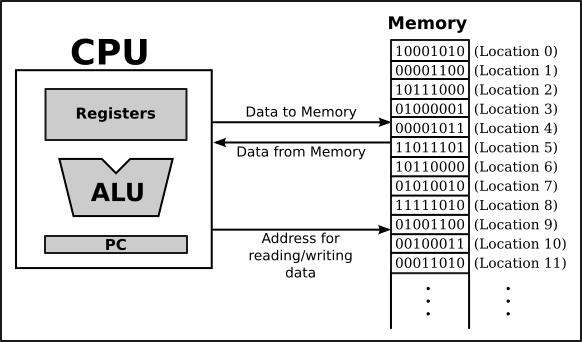

A couple of years ago, during a Computer Architecture course, I had four weeks to work on a final project of my choosing. That's when I first got this idea of a high-level programming language that compiles into BF. 

That idea didn't last very long -- I had zero clue where to start, and four weeks was definitely not enough time to figure it out. This project has plagued my shower thoughts for four years but I finally have something to show for it. 

If you're not familiar with BF, go watch [this video](https://www.youtube.com/watch?v=hdHjjBS4cs8).

## A little taste of what's to come
```javascript
import "io/input"
println("Hello fibonacci!")
stop = readint()
a = 1
b = 1
while (a < stop) {
    print(a, "")
    c = a + b
    a = b
    b = c
}
```

```output
Input: 100000000
Output (shortened):
-------
Hello fibonacci!
1 1 2 3 5 8 13 21 34 55 89 144 233 377 610 987 1597 2584 4181 6765 10946 17711 28657 46368 75025 121393 196418 317811 514229 832040 1346269 2178309 3524578 5702887 9227465 14930352 24157817 39088169 63245986 
-------
bf code size:        149639
parse time:          0.400s
compile time:        0.783s
encode time:         0.877s
bf to c time:        1.011s
c to bin time:       0.594s
run time:            2.320s
```

[Other Examples (helloworld, lists, primes)](https://github.com/ShanThatos/compile-pythonic-to-bf/tree/main/examples)

### What's great about this?
1. This isn't your typical "compile down to BF" project -- it's not a glorified macro tree
2. There's real processing going on here (example has runtime-influencing input)
3. The numbers go above 255 (even though BF only supports 8-bit cells)

### What's not so great about this?
1. It's not actually Python, it's my custom high-level language
    - Check out the [spec](https://github.com/ShanThatos/compile-pythonic-to-bf/blob/main/spec/main.json). It's split across multiple files, but it's pretty readable.
2. Slow runtime -- it compiles the final BF to a C-executable but that's still *slow*


## How did I get here?

### Turing completeness
Have you ever heard of something called [*Turing completeness*](https://en.wikipedia.org/wiki/Turing_completeness#:~:text=In%20colloquial%20usage%2C%20the%20terms,purpose%20computer%20or%20computer%20language.)? It's a term used to describe systems/languages that can perform meaningful computation. 

Turns out BF is Turing complete... how on earth can BF be Turing complete?! Somehow, it's laughably primitive 8-instruction set with no variables & functions is just as computationally capable as Python, Java, or C++.


Well if BF is Turing complete, surely it should be possible to compile a high-level language into BF. 

### The plan
BF's minimalism had me thinking. It's more primitive than Assembly, so why not treat it like a CPU? 



In a basic computer, you have a CPU and program memory. A CPU is built to execute a specific instruction set, and it repeatedly fetches instructions from the program memory. The program memory is an encoded sequence of instructions/labels. Assembly is just a human-readable version of this program memory. Andddd that's pretty much how computers work. For a programming language like C, all of the nitty-gritty Assembly/program memory details are abstracted away by the compiler. 

My plan was simple. 
1. Build a *CPU* in BF
2. Compile a high-level language to Assembly/*program memory*

### It's like a computer, but cursed 💀

For simplicity, we're treating the CPU registers, program memory, and the stack as just "memory".
Let's define an instruction set for our BF CPU. We'll need to be able to do:
- Memory read/write (mov, get, set)
- Arithmetic (add, neg, cmp)
- Conditional Jumps (jp, jpif)
- Input/Output (in, out)
- Stack push/pop (push, pop)

Whatever operations you might need in a high-level language, you can build them out of these 12 basic 1-2 argument instructions. Subtraction is just a negation and addition. Multiplication is repeated addition and conditions. If statements and loops are just conditional jumps. Eventually, for performance reasons, I ended up with 32 instructions D: [instructions spec](https://github.com/ShanThatos/compile-pythonic-to-bf/blob/main/spec/bfasm.json)

#### Memory Layout
Managing dynamically sized stack memory in BF at first sounds like a nightmare. Fortunately, BF has been around for a while and this problem is somewhat solved. 

Check out this awesome video about a [tic-tac-toe AI in BF](https://www.youtube.com/watch?v=qK0vmuQib8Y). In this video, the author came up with a bit of BF code: `+[->+]-`

It's called the "glider" pattern because it keeps moving to the next memory cell until it finds `255`. 

I split up the BF memory into a series of 8-cell blocks that we'll call units. 
Update: Now it's 9-cell blocks, added another marker cell to denote the current instruction -- but that's just an optimization. 

[Unit Layout Code](https://github.com/ShanThatos/compile-pythonic-to-bf/blob/main/c2bf/compile/mem/units.py#L54)

In BF, each cell is 1 byte, so each unit is 8 bytes. Here's the layout of a unit: 


I used the marker cell in combination with the glider `+[->>>>>>>>+]-` pattern to navigate between specially marked units. The flag is used for storing an ASM instruction id. The two empty cells are used for computation. And the last four data cells are enough to store a 32-bit integer. In my code, the unit size is configurable, so theoretically you could go further than 32-bit memory. 

Here's how I structured the units in memory: 


The cherry on top is that by setting the markers for specific units in the computation and stack blocks, we can easily use the glider to navigate between them (for push/pop). We can also use this marker/glider concept when executing instructions (as you'll see later).

#### Encoding Instructions Into Program Memory
Let's look at this example assembly program:
```asm6502
r0: 5
r1: 258
add r0 r1
```

In the interest of supporting 32-bit integers, we'll let labels use all 4 data cells (32 bits) and instructions will have a pair of 2-byte addresses. The resulting program memory would look like this:

**Explanation:** For the add instruction encoding, the data bytes are the two label addresses. `r0` is stored in program memory address `0 0`, and `r1` is stored in program memory address `0 1`. 

To support jumps, we'll also need empty labels that store their own address:
```asm6502
foo: 27
bar: 
baz: 
jp baz
```


#### Reading Data From Program Memory
This is by far the most important part of the BF CPU. For every instruction, we need to **read** the current instruction data from memory, and then **read** the data at the addresses in the instruction. 

In the Computation units block, I dedicated a ['query' unit](https://github.com/ShanThatos/compile-pythonic-to-bf/blob/main/c2bf/compile/mem/workspaces/compute.py#L17) that is solely responsible for reading/writing data from memory.

We'll first focus on marking the addressed unit in the memory. \
Here's what that would look like (pseudocode BF code):
```text
; Pretend A is the 2-byte address of the data we want to read
set the marker for the first unit in memory
while (A[1]) {
    glide to the mark
    move the mark to the next unit
    glide back
    decrement A[1]
}

while (A[0]) {
    glide to the mark
    move the mark by 256 units
    glide back
    decrement A[0]
}
; Now the marker is on the unit we want to read
```

The actual BF code would look like this: 
```brainfuck
; Assume query.empty stores the 2-byte address
; Assume we're at the query marker

[-]-                            ; set query marker to 255
>>>> >>>> [-]--                 ; set the first unit marker to 254
<<<< <<<<

>>>[<<<                         ; while (A[1])
    ++[-->>>> >>>>++]--         ; glide to the 254-mark
    [-] >>>> >>>> [-]--         ; move the mark to the next unit
    +[-<<<< <<<<+]-             ; glide back to the 255-mark
    >>> -                       ; decrement A[1]
]<<<

>>[<<                           ; while (A[0])
    ++[-->>>> >>>>++]--         ; glide to the 254-mark
    [-]  ~~256x8 '>'~~  [-]--   ; move the mark by 256 units
    +[-<<<< <<<<+]-             ; glide back to the 255-mark
    >> -                        ; decrement A[0]
]<<
```

After that, it's pretty straightforward to read the data from the unit. Similar to how you normally copy numbers in BF, just with gliders added!

##### That's some ugly BF code


Just to be clear, I did not write much BF code by hand (I'm not that crazy). I abstracted several common BF patterns into python functions: 
```python
def bf_f(n=1):
    return BFCode(">" if n > 0 else "<") * abs(n)

...

def to(self, mr: memrange):
    return bf_f(self.get_distance(mr))

...

# to and back
def tb(self, mr: memrange, code: BFCodeLike):
    return self.to(mr) + code + self.back(mr)

...

def foreach(self, mr: memrange, code: BFCodeLike):
    assert(mr.size == 1)
    return self.tb(mr, "[-" + self.bt(mr, code) + "]")

...

def copy(self, src: memrange, dest: memrange, temp: memrange):
    assert(src.size == dest.size)
    assert(temp.size == 1)
    code = self.clear(temp) + self.clear(dest)
    for s, d in zip(src, dest):
        code += self.foreach(s, self.inc(d) + self.inc(temp))
        code += self.foreach(temp, self.inc(s))
    return code
```

[workspace.py](https://github.com/ShanThatos/compile-pythonic-to-bf/blob/main/c2bf/compile/mem/workspace.py)

With these abstractions, and many many more, writing BF code was a breeze! \
Here's what my code once looked like for marking/reading a unit in memory:
```python
def mark_unit():
    # set the marker for the first unit in memory
    code = COMPUTE.set(memrange([USIZE], unit=COMPUTE.units[-1]), [254])

    # shifting the marker to the correct unit
    for i, qidx in enumerate(range(query.id.size - 1, -1, -1)):
        code += COMPUTE.foreach(query.id[qidx], marked_unit_fb(mark_next := BFCode()))
        mark_next += "[-]" + ">" * (256**i * USIZE) + bf_set(254)
    
    return code

def get_unit():
    code = mark_unit() + COMPUTE.clear(query.fdata)
    code += marked_unit_fb(copy_code := BFCode(), True)
    for umc, qmc in zip(unit.fdata, query.fdata):
        copy_code += UNIT.clear(unit.empty[0])
        copy_code += UNIT.foreach(umc, UNIT.inc(unit.empty[0]) + inc_qmc := BFCode())
        inc_qmc += marked_unit_bf(COMPUTE.inc(qmc))
        copy_code += UNIT.move(unit.empty[0], umc)
    return code
```

#### Making BF CPU Instructions


##### Ex) mov A B
Let's start with something simple, like the `mov` instruction. 
For the computation units block, these are the units we'll be working with:


The `mov A B` instruction is pretty simple, it just copies the data from `B` to `A`.
```python
def mov():
    code = COMPUTE.move(compute.data2, query.id) + get_unit()   # get B's data
    code += COMPUTE.move(compute.data1, query.id) + set_unit()  # set A's data
    return code
```

Remember, there's a reason these python functions have no arguments. They're just building up BF code that will be added to our BF CPU. We just need to make sure that our BF CPU actually populates `compute.data1` and `compute.data2` with the correct arguments before executing the `mov` instruction.

I would highly advise against looking at my instruction implementations. If you're curious as to why, it's because I had to perform some crazy black magic to minimize the amount of BF code generated for the CPU. My BF CPU jumps between *sub-instructions* to avoid code duplication! 

##### Ex) add A B
Yeah this one's a bit more complicated. \
Before tackling this, I built up a bunch of BF abstractions: 
```python
# incrementing every cell in a memrange
def inc(self, mr: memrange):
    return bf_sum(self.tb(mc, "+") for mc in mr)

...

def if_(self, mr: memrange, code: BFCodeLike):
    assert(mr.size == 1)
    return self.tb(mr, "[[-]" + self.bt(mr, code) + "]")

...

# incrementing a number stored across multiple cells
def inc_num(self, mr: memrange, t1: memrange, t2: memrange, clear_temps = True):
    if mr.size == 1: 
        return self.inc(mr)
    
    code = BFCode()
    if clear_temps:
        code += self.clear(t1) + self.clear(t2)
    
    # incrementing the last cell
    code += self.inc(mr[-1])

    # checking if that cell overflowed to 0 (t1 = !mr[-1])
    code += self.copy(mr[-1], t1, t2) + self.not_(t1, t2)
    
    # if it overflowed, carry to remaining cells
    code += self.if_(t1, self.inc_num(mr[:-1], t1, t2, False))
    return code
```

The `inc_num` abstraction seems pretty intuitive, right? It functions like normal addition, but in base 256. 

Here's the `add A B` instruction:
```python
def add():
    # get A and B's data
    code = COMPUTE.move(compute.data2, query.id) + get_unit()
    code += COMPUTE.move(query.data, cextra.data)
    code += COMPUTE.copy(compute.data1, query.id, compute.empty[0]) + get_unit()

    A = query.data
    B = cextra.data

    for i in range(A.size - 1, -1, -1):
        code += COMPUTE.foreach(B[i], inc_A := BFCode())
        inc_A += COMPUTE.inc_num(A[:i+1], query.id[0], query.id[1])
    
    code += COMPUTE.move(compute.data1, query.id) + set_unit()
    return code
```

##### Ex) mul A B

Anddd just for fun, here's `mul A B` (one of the many extra instructions I added for performance):
```python
def mul():
    code = COMPUTE.move(compute.data2, query.id) + get_unit()
    code += COMPUTE.move(query.data, cextra.data)
    code += COMPUTE.copy(compute.data1, query.id, compute.empty[0]) + get_unit()
    
    code += COMPUTE.move(compute.data1, compute.empty)
    code += COMPUTE.move(query.data, compute.data)

    # Keep double-halving until B is 0
    code += COMPUTE.while_(cextra.marker, loop_expr_code := BFCode(), loop_code := BFCode())
    loop_expr_code += COMPUTE.or_keep(cextra.marker, cextra.flag, cextra.data)
    
    # Checking if B is odd
    loop_code += COMPUTE.clear(cextra.empty)
    loop_code += COMPUTE.foreach(cextra.data[-1], COMPUTE.inc(cextra.empty[0]) * 128 + COMPUTE.inc(cextra.empty[1]))
    loop_code += COMPUTE.move(cextra.empty[1], cextra.data[-1])
    loop_code += COMPUTE.set(cextra.empty[1], [1])

    # If B is odd, add A to the result
    loop_code += COMPUTE.if_(cextra.empty[0], COMPUTE.clear(cextra.empty[1]) + (accum_code := BFCode()))
    loop_code += COMPUTE.if_(cextra.empty[1], double_half_code := BFCode())

    # accum: Add A to the result
    accum_code += COMPUTE.dec(cextra.data[-1])
    for i in range(query.data.size - 1, -1, -1):
        accum_code += COMPUTE.foreach(compute.data[i], COMPUTE.inc(cextra.empty[0]) + COMPUTE.inc_num(query.data[:i+1], query.id[0], query.id[1]))
        accum_code += COMPUTE.move(cextra.empty[0], compute.data[i])

    # double_half: Double A, halve B
    double_half_code += COMPUTE.lshift(compute.data, cextra.empty[0], cextra.empty[1])
    double_half_code += COMPUTE.rshift(cextra.data, cextra.empty[0], cextra.empty[1])

    code += COMPUTE.clear(compute.data)
    code += COMPUTE.move(compute.empty, query.id) + set_unit()
    return code
```


#### Putting It All Together (BF CPU)

There are a couple pieces of the puzzle that I haven't mentioned yet.
- **Instruction Pointer**: The BF CPU needs to know which address in program memory it's currently executing. For ease of implementation, let's just make the first unit in the program memory block the instruction pointer (and any other general purpose registers can follow).
- **Execution End**: The BF CPU needs to know when to stop executing instructions. I used the `compute.marker` cell to designate whether the CPU should keep executing instructions. If the marker is 0, the CPU halts. I also made an `end` instruction that sets the marker to 0.


The BF CPU will repeatedly execute these steps:
1. Increment the instruction pointer
2. Read the current instruction from program memory
3. Find the matching instruction in the CPU
4. Execute the instruction

Here's what that looks like:
```python
def processor():
    # Setting compute.marker (compute.running) to 255
    code = bf_f(COMPUTE.get_index(compute.running))
    code += bf_set(255, True)
    
    # CPU loop
    code += COMPUTE.loop(compute.running, program_loop := BFCode())

    # IP memory range (relative to COMPUTE workspace block)
    ip_mr = get_register_mr("ip")

    # Increment IP
    program_loop += COMPUTE.tb(ip_mr[unit.marker.slice], inc_ip := BFCode())
    inc_ip += COMPUTE.inc_num(unit.data2, unit.empty[0], unit.empty[1])
    
    # Read instruction from program memory
    program_loop += COMPUTE.copy(ip_mr[unit.data2.slice], query.id, ip_mr[unit.empty[0].slice])
    program_loop += get_unit()
    program_loop += COMPUTE.move(query.fdata, compute.fdata)

    # Find matching instruction
    program_loop += COMPUTE.loop(compute.flag, instruction_loop := BFCode())

    for ins in INSTRUCTIONS[1:]:
        instruction_loop += COMPUTE.copy(compute.flag, compute.empty[0], compute.empty[1])
        instruction_loop += COMPUTE.dec(compute.empty[0]) * ins.id
        instruction_loop += COMPUTE.not_(compute.empty[0], compute.empty[1])

        # If compute.flag matches instruction id, run it
        instruction_loop += COMPUTE.if_(compute.empty[0], run_ins := BFCode())
        run_ins += COMPUTE.clear(compute.flag) + ins.get_code()

    return code
```


### Halfway There!

At this point that's all you need to build a custom Assembly language that can be encoded into BF cells and executed by a BF CPU. Obviously I skipped over a lot of instructions, but I'm sure you get the gist of it.

## Let's recap:

### 1. Custom Assembly language gets encoded into bytes:

```asm6502
r0: 0
ptr:
str_himom: 104, 105, 109, 111, 109, 0

loop:
add ptr 1
get r0 ptr
jpif loop_body r0
    end
loop_body:
    out r0
    jp loop
```


Here's my code that translates the Assembly into bytes: [encode.py](https://github.com/ShanThatos/compile-pythonic-to-bf/blob/main/c2bf/compile/bfasm/encode.py)

### 2. Bytes → BF Cells (quite literally building each cell/byte one by one with BF):
```python
def encode_bytes_to_bf(mem: List[int]) -> BFCode:
    code = []
    for n in mem:
        if n:
            code.append(bf_set(n, True).to_bf())
        code.append(">")
    code.append("<" * len(mem))
    return bf_fb(COMPUTE.size, "".join(code))
```

### 3. Attach the BF CPU and let it rip!

```python
def encode_to_bf_with_processor(mem: List[int]) -> BFCode:
    code = encode_bytes_to_bf(mem)
    code += processor()
    return code
```

```output
Output:
-------
himom
-------
bf code size:   33315
compile time:   0.484s
run time:       0.102s
```

**33,315** characters worth of BF code to print "himom"! 

And yet, it used to be nearly 10 times that size before I optimized the BF CPU. To be fair, the BF CPU used for this output has about 30 instructions. So nearly 1,000 characters per instruction -- doesn't sound too bad now, does it?

## What's next?

Next, we'll build a high-level language that compiles into this custom Assembly. This post is already long enough, so I'll save that for next time. 

<div class="px-3 py-2 rounded-lg text-center" style="border: 5px solid #111111; background-color: #38434f;">
Keep reading in the next post! <br>
<a href="/blogs/c2bf-p2?scrollTo=top">Compiling Pythonic to Brainf**k (Part 2)</a>
</div>
