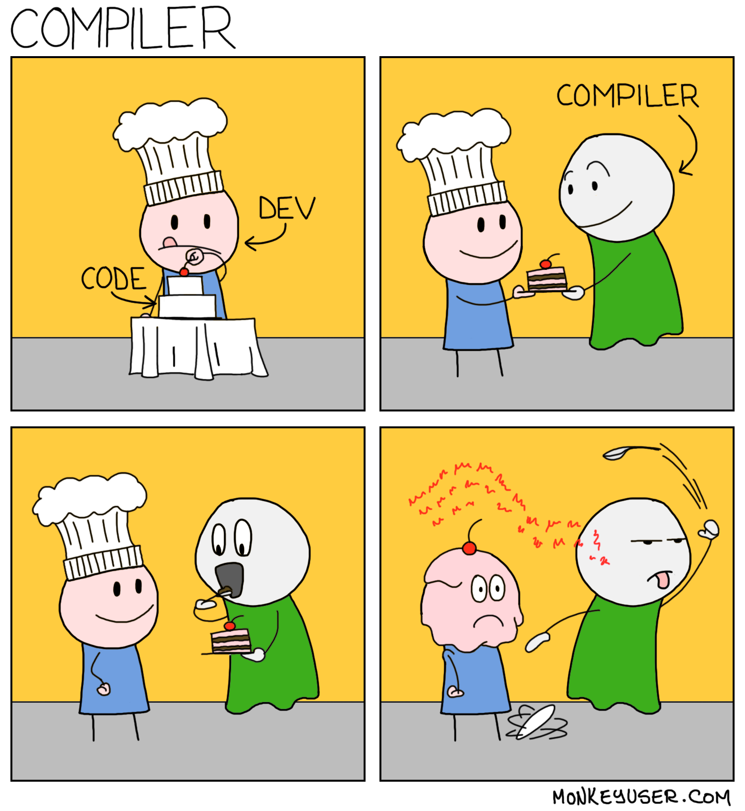

Check out the previous post before reading this!  
<a href="/blogs/c2bf-p1?scrollTo=top">Compiling Python to Brainf**k (kinda)</a>

### Python-like High-Level Language

Now that we have a BF CPU, we can start building a high-level language that compiles into Assembly. 

First part of the compiler is the lexer/parser. You can probably find a billion tutorials on how to build one of these, so I won't go into too much detail. I built a parser that uses a SPEC to define a language's grammer, and parses input into an AST. 

Check out the SPEC for my language <!-- TODO link -->

<!-- TODO link parser -->
The steps I took for the parsing were:
1. Understand the language's grammar
    - Reading the SPEC files
    - Identifying notable tokens
2. Lexing: Extracting tokens from the input
3. Parsing: Matching the tokens to the SPEC, and building an AST

It works surprisingly well! Here's a snippet of 